# Lode V1 Incident Platform Architecture

## System Flow

```mermaid
flowchart LR
    K[Main application Kafka\nincident.alert.v1] --> KA[Strict Kafka adapter]
    M[Manual error\nsummary + error text\noptional trace/repository] --> MA[Manual adapter]
    KA --> S[incident-signal.v1]
    MA --> S
    S --> C[Deterministic correlation]
    C --> I[Incident + immutable association history]
    I --> R[Immutable investigation run]
    R --> P[Read-only Provider adapters]
    P --> E[Sealed raw evidence]
    E --> G[Normalized evidence graph]
    G --> AI[Plan / query / synthesize]
    AI --> V[Independent verifier]
    V --> D[investigation-report.v1 causal DAG]
    D --> H[Human review and action decisions]
    H --> Q[Accepted cases and offline evaluation]
```

Production and test are physically separate deployments with independent
databases and configuration. Environment is not represented in the domain,
API, database, UI, filters, or correlation. Workspace is the hard
main-application boundary. Only that application publishes Kafka alerts;
Provider Connectors cannot create incidents, and side-service errors enter
actively only through manual intake.

## Intake And Correlation

`incident.alert.v1` remains byte-for-byte contract compatible with its frozen
JSON Schema and continues to reject unknown fields. The Kafka topic selects the
Workspace. The adapter retains producer alert identity, opaque trace identity,
source revision, event, and recursive error cause in `incident-signal.v1`.

Manual intake is a separate `manual-incident.v1` request at
`POST /workspaces/{workspace_id}/manual-incidents`. It requires only `summary`
and `error_text`; `trace_id` and an enabled code `repository_binding_id` are
optional. `Idempotency-Key` is a transport header generated by the Web client.
The server owns receipt time, canonical fingerprint, and initial
`unclassified` severity. Missing repository means explicit unknown source, not
the Workspace main application. Raw error text is sealed and only a masked
projection plus controlled ValueRefs reaches a model.

Kafka position ownership is serialized transactionally across accepted,
invalid, and unassigned paths. Each `(topic, partition, offset)` produces one
immutable `ingestion_events` terminal record; processing never inserts a
provisional state and later updates it. DLQ replay validates with the current
strict adapter, preserves the original failure event, and creates or reuses the
canonical signal without rewriting ingestion history.

Correlation is deterministic within one Workspace. Exact trace identity may
auto-link. Repository identity, canonical error fingerprint, resource entities,
and time proximity contribute to scored linkage. Scores at least `0.85`
auto-link; `0.60` through less than `0.85` create a human candidate; lower
scores create a new incident. A manual signal without trace or repository always
creates a new incident. Candidate decisions, merge, and split append association
events and never rewrite signals.

## Investigation And Evidence

Signal deltas create a new run only for severity escalation, key entity or
revision change, recovery, or human-supplied evidence. Critical escalation is
immediate; other deltas coalesce for 30 seconds. The initial evidence window is
the signal span plus 15 minutes on each side and expands through one, six, and
24 hours when gaps remain. Pause and cancel stop at safe operation boundaries.
Resume, evidence supplements, follow-up questions, and hypothesis branches
create immutable child runs. Comparisons cover input, hypotheses, evidence,
causal graph, and conclusions.

The Connector router and Provider adapters are separate from investigation
orchestration. Loki, Elasticsearch, OpenSearch, PostgreSQL, MySQL, ClickHouse,
cataloged HTTPS, Prometheus, Tempo, Jaeger, Kubernetes, GitHub, GitLab, and Argo
CD expose typed read-only operations. Kubernetes rejects writes, exec,
port-forward, watch, and Secret content. Raw responses are sealed independently;
ordinary artifacts are bounded, masked, injection-marked, and normalized into
metric, span, resource-state, deployment, pipeline, configuration, and entity
relation evidence.

Repository binding or revision changes enqueue deterministic analysis. The
`resource_analyst` model role may add anchored component, entrypoint,
dependency, runbook, and ownership semantics, but cannot invent a source path,
expand authorization, or override scanner facts. The existing rule that the
first read of a non-alert repository freezes its bound-branch HEAD as
authoritative remains unchanged.

## Reports And Human Control

`investigation-report.v1` is a typed causal DAG. Every node, edge, impact claim,
finding, and action recommendation cites investigation-owned evidence. The
independent verifier covers every node, edge, and code finding and verifies
source authority, counter-evidence, and each causal hop. Missing manual source
is an explicit report gap.

Recommendations do not become actions automatically. Human acceptance creates a
formal action with an active Workspace member as owner. The state machine is
`open -> in_progress -> validation -> completed`, with `blocked` and
`cancelled` branches. Reviews are append-only and corrections point to
`supersedes_review_id`. Only human-accepted reports enter similar-incident
retrieval; a retrieved case is a hypothesis clue, never current-incident
authority or online training data.

## Database And Code Boundaries

The only migration is `alembic/versions/v1_initial.py` with revision `v1` and no
parent. It creates the final 87-table schema and fully downgrades it. No earlier
revision, old-database detector, data converter, alias, compatibility view,
fallback, or dual write exists. All built-in Connector kind versions and all
Lode-owned persisted protocols start at V1.

Route responsibilities are split across `control_plane.py`,
`evidence_connectors.py`, `incidents.py`, `incident_correlations.py`,
`investigations.py`, and `investigation_controls.py`. Application services own
policy and orchestration; Provider adapters own external protocol details;
evidence normalizers own graph projection. The incident page is a state
container composed with independent report/evidence and action components.

The V1 rebuild adds no runtime dependency but changes architecture, database
bootstrap, API contracts, and the Web development workflow. Contributors must
start from an empty database. OIDC/MFA, organization tenancy, KMS envelope
encryption, object storage/WORM, dedicated migration workers, distributed rate
limits, event push, and backup/restore remain outside this V1 scope.
